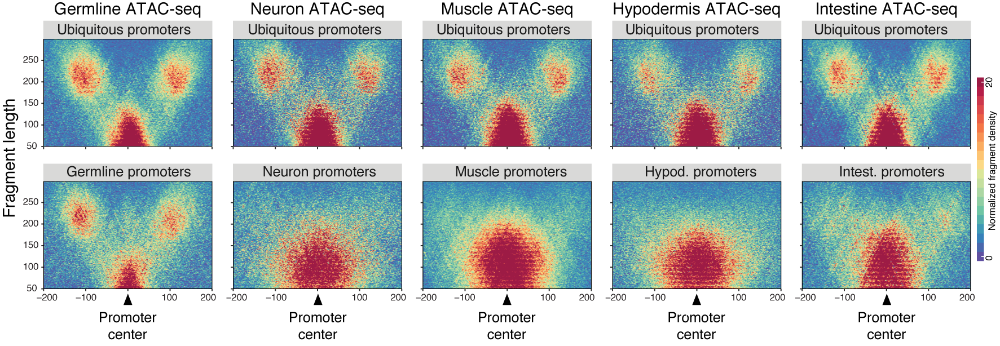

# VplotR v0.4.0

## Sequencing fragment lengths bear information 
Sequencing libraries generated by MNase-seq, DNase-seq or ATAC-seq to study nucleosome arrangement are traditionally sequenced in a paired-end manner. This was originally useful to select 147-bp-long sequencing reads in MNase-seq, theoretically corresponding to nucleosomal DNA (#Valouev2008-mz, #Gaffney2012-yl). However, more recent approaches have elegantly used MNase-seq fragment lengths to elucidate transcription factors binding patterns (#Henikoff2011-uu). Furthermore, emerging techniques such as ATAC-seq generate genomic fragments not only from nucleosome-spanning DNA but also from nucleosome-depleted regions, and a multi-modal distribution of short or longer fragments is expected (#Buenrostro2013-ps).  

## A visualization approach more powerful than traditional aggregate metaplots
Representation of ATAC-seq data is usually based on the aggregation of the linear ATAC-seq signal over multiple genomic loci. However, the distribution of fragments lengths can also give valuable information on the local arrangement of nucleosomes flanking an nucleosome-depleted region (#Schep2015-jk). Thus, using the ATAC-seq fragment lengths as a second parameter to investigate the accessibility patterns at specific genomic loci may bring insights than the traditional aggregated metaplots. This can be done by generating ATAC-seq fragment density plots.  

Fragment density plots, also known as "V-plots" have been introduced [for the first time](https://www.ncbi.nlm.nih.gov/pmc/articles/PMC3215028/) by the Henikoff lab in 2011, using MNase-seq data. More recently, ATAC-seq V-plots have proven to be very instructive to understand the molecular organization of the chromatin. For instance, the [nucleoATAC]((https://genome.cshlp.org/content/early/2015/08/27/gr.192294.115)) package relies on cross-correlation of ATAC-seq fragment density plots to accurately map nucleosome occupancy along the genome.  

## Focus of VplotR
VplotR package aims to streamline the process of generating V-plots. It contains functions to import paired-end sequencing bam files and generate V-plots around genomic loci of interest. VplotR is built on [ggplot2](https://ggplot2.tidyverse.org/) and makes full use of its potential. As such, it is easy to generate V-plots in batches and combine them with other plots to make publication-ready figures.  

The current release of VplotR is v0.4.0. This is the release which has been used in Serizay et al., submitted.  

To read more about VplotR, check out the [Get started](https://js2264.github.io/VplotR/articles/VplotR.html) vignette.